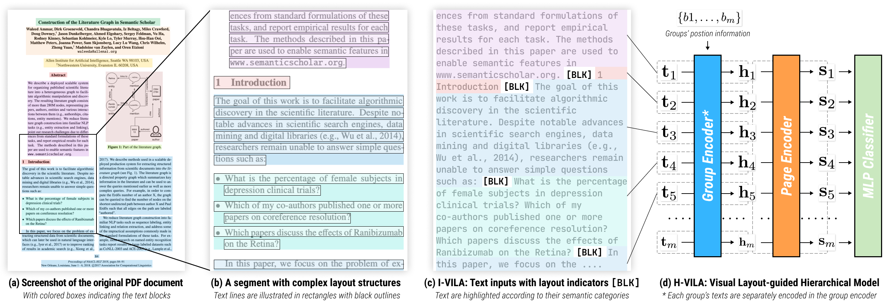
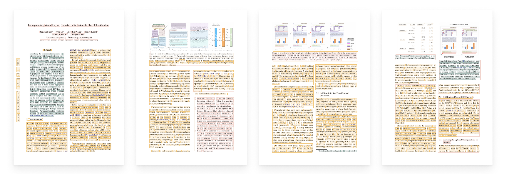

# VILA🌴 <br> Incorporating **VI**sual **LA**yout Structures for Scientific Text Classification

<a href="https://arxiv.org/abs/2106.00676"></a>
<a href="https://github.com/Layout-Parser/layout-parser/blob/master/LICENSE"></a>

- [VILA🌴 <br> Incorporating **VI**sual **LA**yout Structures for Scientific Text Classification](#vila--incorporating-visual-layout-structures-for-scientific-text-classification)
  - [Motivation](#motivation)
  - [Installation](#installation)
  - [Usage](#usage)
    - [Accessing The S2-VLUE Datasets](#accessing-the-s2-vlue-datasets)
    - [Run Inference/Prediction](#run-inferenceprediction)
      - [Model Weights](#model-weights)
      - [MMDA VILA Example](#mmda-vila-example)
      - [`PDFPredictor`s in VILA](#pdfpredictors-in-vila)
    - [Training](#training)
      - [Directory Structure](#directory-structure)
      - [Obtaining the Dataset](#obtaining-the-dataset)
      - [Training Scripts](#training-scripts)
    - [Evaluation Toolkit](#evaluation-toolkit)
  - [Note](#note)
  - [Citation](#citation)

## Motivation 

Scientific papers typically organize contents in visual groups like text blocks or lines, and text within each group usually have the same semantics. We explore different approaches for injecting the group structure into the text classifiers, and build models that improves the accuracy or efficiency of the scientific text classification task. 



## Installation 

After cloning the github repo, you can either install the `vila` library or just install the dependencies: 
```bash 
git clone git@github.com:allenai/VILA.git
cd VILA 
conda create -n vila python=3.6
pip install -e . # Install the `vila` library 
pip install -r requirements.txt # Only install the dependencies 
```

We tested the code and trained the models using `Python≥3.6`, `PyTorch==1.7.1`, and `transformers==4.4.2`. 

## Usage 

### Accessing The S2-VLUE Datasets

Please check the detailed instructions in [`datasets/README.md`](datasets/README.md).

### Run Inference/Prediction 

#### Model Weights

We've uploaded a collection of pre-trained models to HuggingFace's model Hub:

| Weights Name                                                                                                              | Model    | Dataset  | F1    | Latency |
| ------------------------------------------------------------------------------------------------------------------------- | -------- | -------- | ----- | ------- |
| layoutlm-base-uncased                                                                                                     | baseline | docbank  | 91.06 | 52.56   |
| [allenai/ivila-block-layoutlm-finetuned-docbank](https://huggingface.co/allenai/ivila-block-layoutlm-finetuned-docbank)   | ivila    | docbank  | 92.00 | -       |
| [allenai/hvila-block-layoutlm-finetuned-docbank](https://huggingface.co/allenai/hvila-block-layoutlm-finetuned-docbank)   | hvila    | docbank  | 87.78 | 16.37   |
| [allenai/hvila-row-layoutlm-finetuned-docbank](https://huggingface.co/allenai/hvila-row-layoutlm-finetuned-docbank)       | hvila    | docbank  | 91.27 | 28.07   |
| layoutlm-base-uncased                                                                                                     | baseline | grotoap2 | 92.34 | 52.56   |
| [allenai/ivila-block-layoutlm-finetuned-grotoap2](https://huggingface.co/allenai/ivila-block-layoutlm-finetuned-grotoap2) | ivila    | grotoap2 | 93.38 | -       |
| [allenai/hvila-block-layoutlm-finetuned-grotoap2](https://huggingface.co/allenai/hvila-block-layoutlm-finetuned-grotoap2) | hvila    | grotoap2 | 92.37 | 16.37   |
| [allenai/hvila-row-layoutlm-finetuned-grotoap2](https://huggingface.co/allenai/hvila-row-layoutlm-finetuned-grotoap2)     | hvila    | grotoap2 | 91.65 | 28.07   |

#### MMDA VILA Example

[MMDA](https://github.com/allenai/mmda/) is our newly designed toolkit that provides flexible supports for PDF document analysis. Please check the VILA predictor example [here](https://github.com/allenai/mmda/tree/main/examples/vila_for_scidoc_parsing) for more details.  

#### `PDFPredictor`s in VILA

In VILA repo, we also implemented a set of `PDFPredictor`s. Please refer to the example code below:

```python
import layoutparser as lp # For visualization 

from vila.pdftools.pdf_extractor import PDFExtractor
from vila.predictors import HierarchicalPDFPredictor
# Choose from SimplePDFPredictor,
# LayoutIndicatorPDFPredictor, 
# and HierarchicalPDFPredictor

pdf_extractor = PDFExtractor("pdfplumber")
page_tokens, page_images = pdf_extractor.load_tokens_and_image(f"path-to-your.pdf")

vision_model = lp.EfficientDetLayoutModel("lp://PubLayNet") 
pdf_predictor = HierarchicalPDFPredictor.from_pretrained("allenai/hvila-block-layoutlm-finetuned-docbank")

for idx, page_token in enumerate(page_tokens):
    blocks = vision_model.detect(page_images[idx])
    page_token.annotate(blocks=blocks)
    pdf_data = page_token.to_pagedata().to_dict()
    predicted_tokens = pdf_predictor.predict(pdf_data, page_token.page_size)
    lp.draw_box(page_images[idx], predicted_tokens, box_width=0, box_alpha=0.25)
```



### Training 


#### Directory Structure 

```
VILA
├─ checkpoints  # For all trained weights 
│  └─ grotoap2  # For each dataset                                 
│     ├─ baseline  # For the experiment type, e.g., baseline, ivila, hvila, ...
│     │  └─ bert-base-uncased  # For the used base model, e.g., bert-base-uncased. 
│     │     ├─ checkpoint-199999                                
│     │     ├─ checkpoint-299999                                 
│     │     ├─ all_results.json                                       
│     │     └─ pytorch_model.bin                         
│     └─ ivila-BLK-row                           
│        └─ microsoft-layoutlm-base-uncased 
└─ data                                       
   ├─ docbank
   ├─ grotoap2
   └─ s2-vl

```

#### Obtaining the Dataset

We provide the scripts to help you easily download and save the datasets into the aforementioned structure. Please follow the instructions in [`datasets/README.md`](datasets/README.md).

#### Training Scripts

All training scripts are in the `./scripts` folder. 

1. Train the baseline models
    ```bash
    cd scripts
    # bash train_baseline.sh [dataset-name] [base-model-name]
    bash train_baseline.sh grotoap2 bert-base-uncased
    bash train_baseline.sh docbank microsoft/layoutlm-base-uncased
    ```
2. Train the I-VILA models
    ```bash
    cd scripts
    # bash train_ivila.sh [dataset-name] [how-to-obtain-layout-indicators] [used-special-token] [base-model-name]
    bash train_ivila.sh grotoap2 row BLK microsoft/layoutlm-base-uncased 
      # Row is an alias for textline 
    bash train_ivila.sh docbank block SEP bert-base-uncased
      # We can also use the default special tokens like SEP 
    bash train_ivila.sh s2-vl sentence BLK roberta-base 
      # We can also extract the sentence breaks using spacy and use them as indicators.
    ```
3. Train the H-VILA models
    ```bash
    cd tools
    python create_hvila_model_base_weights.py 

    cd ../scripts
    # bash train_hvila.sh \
    #  [dataset-name] \
    #  [H-VILA-names] \
    #  [Group-Encoder-Output-Aggregation-Function] \
    #  [How-to-Obtain-Bounding-Box] \
    #  [Use-textline-or-block-as-the-group]

    bash train_hvila.sh \
      grotoap2 \
      weak-strong-layoutlm \
      average \
      first \
      row 
    ```
    In the above example, we use the:

    1. *average* of the group encoder outputs for all tokens as the group representation 
    2. the bounding box of the *first* token as the group's bounding box
    3. textline (or row) to construct the groups

### Evaluation Toolkit 

The evaluation toolkit can generate a detailed report for the prediction accuracy (marco F1 scores) and Visual Layout consistency (group entropy) for the prediction files `test_predictions.csv` produced by the training scripts. 

1. Generate reports for a group of experiments for a specific dataset
  ```bash
    cd tools
    python generate-eval.py --dataset_name grotoap2 --experiment_name baseline
    # It will create a _reports folder in ../checkpoints/grotoap2/baseline and store the 
    # scores in the report.csv file. 
  ```
2. Generate reports for all experiments for a specific dataset
  ```bash
    cd tools
    python generate-eval.py --dataset_name grotoap2
    # It will create reports for all experiments in the ../checkpoints/grotoap2/ folder
    # Also it will aggregate all the results and save them in ../checkpoints/grotoap2/_reports 
  ```
3. Generate reports for per-class accuracy
  ```bash
    cd tools
    python generate-eval.py --dataset_name grotoap2 --experiment_name baseline --store_per_class
    # In additiona to the report.csv file, it will also generate a report_per_class.csv
    # table in the corresponding folder. 
  ```

**Note**: this evaluation toolkits might take a long time to run as calculing the group entropy may take long. 


## Note

In order to support the AutoModel API, we changed the default transformers requirements to `>=4.5` instead of `4.4.2`. If you're working on reproducing the results, you might want to downgrade the transformers version to 4.4.2 to get the matching results. 

## Citation

```
@article{shen2022vila,
  title={VILA: Improving structured content extraction from scientific PDFs using visual layout groups},
  author={Shen, Zejiang and Lo, Kyle and Wang, Lucy Lu and Kuehl, Bailey and Weld, Daniel S and Downey, Doug},
  journal={Transactions of the Association for Computational Linguistics},
  volume={10},
  pages={376--392},
  year={2022},
  publisher={MIT Press}
}
```

